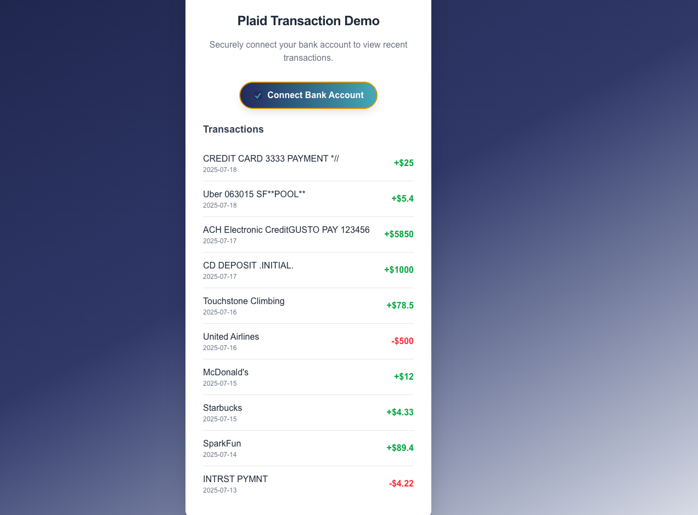

# Plaid Transaction Demo (Next.js + Tailwind)

A modern demo app that lets users securely connect a (sandbox) bank account using the Plaid API and view recent transactions, styled with Tailwind CSS and built on Next.js.

 <!-- Add a screenshot if you like -->

---

## Features

- 🔗 **Connect bank account** using Plaid Link (sandbox/test mode)
- 🔐 **Never handles bank credentials directly** (Plaid Link UI handles auth)
- 📋 **Displays recent transactions** in a clean, Plaid-inspired UI
- ⚡️ Built with **Next.js API routes**, modular React components, and Tailwind CSS
- 🧩 **Easy to extend** for production Plaid or other data sources

---

## Getting Started

### 1. **Clone the repository**

```bash
git clone https://github.com:evilboss/plaid-next.git
cd plaid-next
